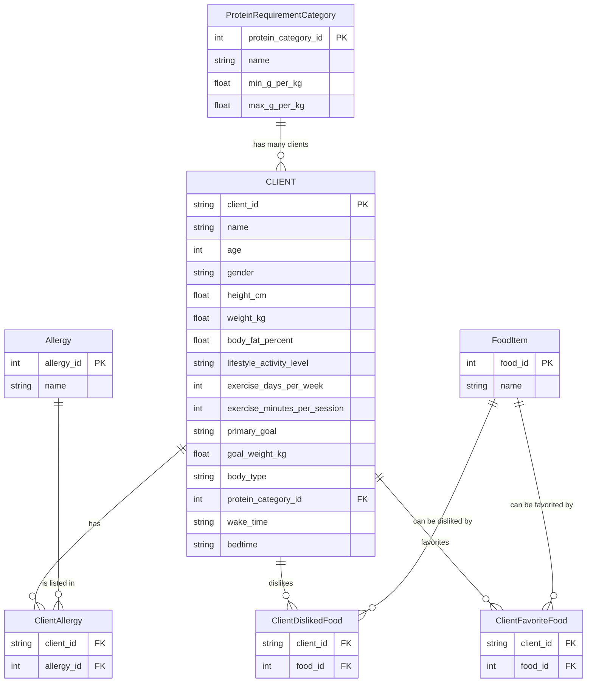

```mermaid
    erDiagram
    CLIENT {
        string client_id PK
        string name
        int age
        string gender
        float height_cm
        float weight_kg
        float body_fat_percent
        string lifestyle_activity_level
        int exercise_days_per_week
        int exercise_minutes_per_session
        string primary_goal
        float goal_weight_kg
        string body_type
        int protein_category_id FK
        string wake_time
        string bedtime
    }

    ProteinRequirementCategory {
        int protein_category_id PK
        string name
        float min_g_per_kg
        float max_g_per_kg
    }

    Allergy {
        int allergy_id PK
        string name
    }

    ClientAllergy {
        string client_id FK
        int allergy_id FK
    }

    FoodItem {
        int food_id PK
        string name
    }

    ClientDislikedFood {
        string client_id FK
        int food_id FK
    }

    ClientFavoriteFood {
        string client_id FK
        int food_id FK
    }

    ProteinRequirementCategory ||--o{ CLIENT : "has many clients"
    CLIENT ||--o{ ClientAllergy : "has"
    Allergy ||--o{ ClientAllergy : "is listed in"

    CLIENT ||--o{ ClientDislikedFood : "dislikes"
    FoodItem ||--o{ ClientDislikedFood : "can be disliked by"

    CLIENT ||--o{ ClientFavoriteFood : "favorites"
    FoodItem ||--o{ ClientFavoriteFood : "can be favorited by"
```